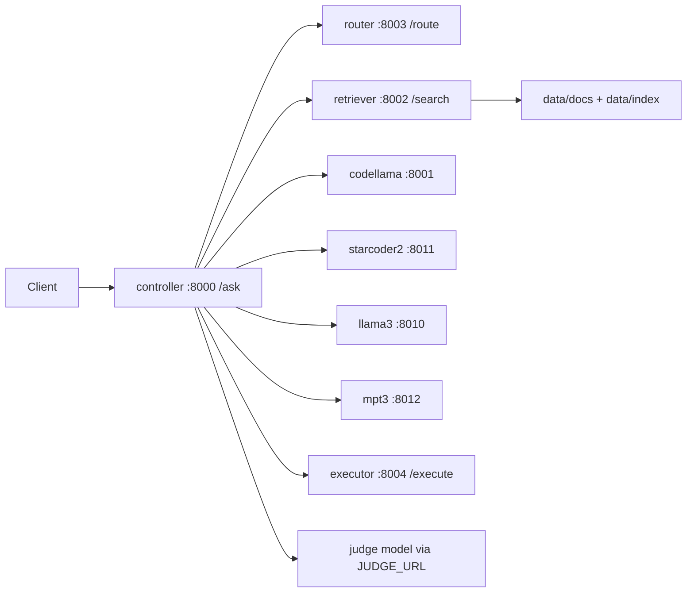
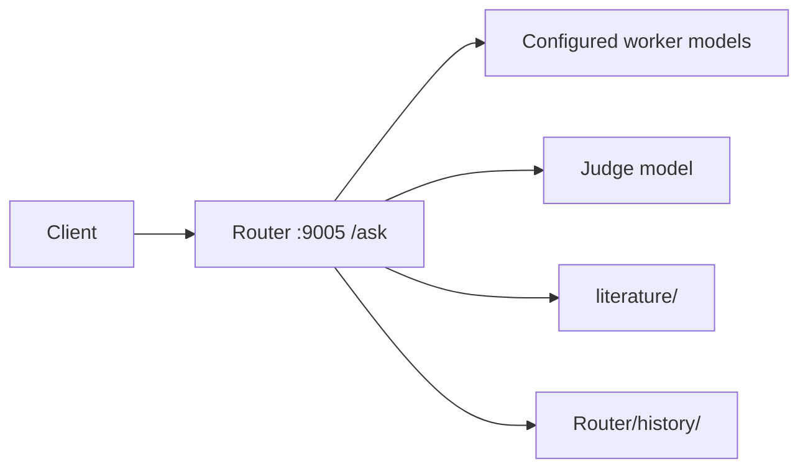
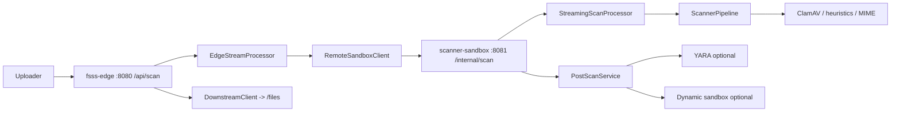

# Developer / Agent Guide

Документ собран по фактическому состоянию репозитория на 2026-05-01. История предыдущих чатов в эту сессию не подгружена, поэтому все выводы ниже сделаны по исходникам, конфигам, тестам и структуре проекта.

## 1. Статус сервисов

### Python AI contour

- `controller` (`Python_AI_Model/services/controller.py`)
  - Готово: endpoint `POST /ask`, вызов `router`, `retriever`, model endpoints, judge synthesis, базовый scoring, provenance и execution checks.
  - В процессе: нет устойчивой сессионной модели, нет постоянного хранилища диалога, consensus-логика эвристическая.
- `retriever` (`Python_AI_Model/services/retriever.py`)
  - Готово: индексация документов, JSON fallback, optional FAISS, endpoint'ы `/index` и `/search`.
  - В процессе: нет incremental reindex, нет фильтров по метаданным, база знаний сейчас фактически пуста.
- `router` (`Python_AI_Model/services/router.py`)
  - Готово: rule-based route selection и optional LLM fallback.
  - В процессе: словарь тегов ограничен пятью маршрутами, нет обучения/тонкой настройки.
- `executor` (`Python_AI_Model/services/executor.py`)
  - Готово: API для запуска Python и C/C++, cleanup временных каталогов, optional Docker mode.
  - В процессе: sandbox слабый, изолированность зависит от Docker, тесты `executor` в текущем окружении зависают.
- `model_server_llamacpp` (`Python_AI_Model/services/model_server_llamacpp.py`)
  - Готово: запуск GGUF-моделей через `llama.cpp`, health/debug endpoints.
  - В процессе: нет streaming-generation и logprob, отказоустойчивость минимальная.
- `model_server_hf` (`Python_AI_Model/services/model_server_hf.py`)
  - Готово: inference через Transformers pipeline, deterministic fallback без ML stack.
  - В процессе: нет batching, нет streaming, fallback возвращает заглушечный текст вместо реального вывода модели.
- `index_faiss.py`
  - Готово: отдельный CLI для построения индекса.
  - В процессе: нет cron/incremental workflow.

### C++ orchestration contour

- `Router` (`Router/src/main.cpp`)
  - Готово: parallel fan-out по worker-моделям, judge flow, local literature search, JSONL-history, `/health` и `/ask`.
  - В процессе: только `http`, нет auth/rate limiting/tests, нет streaming-ответов.

### Secure upload contour

- `fsss-edge` (`security_server_and_router_to_ai/untitled`, профиль `edge`)
  - Готово: API key auth, rate limit, in-flight limit, streaming multipart ingest, sha256, filename sanitization, remote sandbox call, downstream forwarding, security logging.
  - В процессе: downstream-контракт не выровнен с примерным `webServer`, нет persistent queue/retry orchestration.
- `scanner-sandbox` (`security_server_and_router_to_ai/untitled`, профиль `sandbox`)
  - Готово: streaming pipeline, Tika MIME, signature scan, entropy check, ClamAV, macro/script heuristics, post-scan hooks, metrics.
  - В процессе: dynamic analysis по умолчанию выключен и контроллер отдает заглушку, YARA выключен и требует внешнюю установку.
- `clamav` (Docker dependency)
  - Готово: предусмотрен как внешний malware engine для `ClamAvScanner`.
  - В процессе: сервис описан только как docker dependency, собственного кода в репозитории нет.

### Auxiliary services

- `webServer` (`webServer/webServer`)
  - Готово: минимальный Spring Boot upload endpoint `POST /api/upload`, сохранение файла в `uploads/`.
  - В процессе: не совместим по контракту с `fsss-edge`, нет JSON API, нет тестов.
- `UI_Web`
  - Готово: только структура каталогов и файлов.
  - В процессе: вся HTML/CSS/JS логика фактически отсутствует.
- `literature`
  - Готово: каталог предусмотрен в обоих AI-контурах.
  - В процессе: не заполнен контентом.

## 2. Что реально проверено в текущем окружении

- Проходят Python-тесты:
  - `Python_AI_Model/tests/test_router.py`
  - `Python_AI_Model/tests/test_controller_integration.py`
- Не подтверждены как стабильные в этом окружении:
  - `Python_AI_Model/tests/test_executor.py`
  - `Python_AI_Model/tests/test_regression_bugfix.py`
  Эти тесты зависают внутри execution path.
- JVM-тесты не были полноценно выполнены:
  - сначала отсутствовал `JAVA_HOME`;
  - затем Gradle wrapper уперся в сетевую блокировку при скачивании `gradle-8.2-bin.zip`.

## 3. Общая архитектура

### 3.1 AI contour Р Р…Р В° Python



### 3.2 Альтернативный C++ contour



### 3.3 Secure upload contour



## 4. Порты и основные зависимости

| Компонент | Порт | Зависимости |
| --- | --- | --- |
| `controller` | 8000 | `router`, `retriever`, `executor`, model endpoints, optional judge |
| `retriever` | 8002 | `data/docs`, `data/index`, optional `faiss`, optional `sentence-transformers` |
| `router` (Python) | 8003 | optional route-LLM |
| `executor` | 8004 | `python`, `g++`, optional Docker |
| `codellama` | 8001 | GGUF model + `llama.cpp` |
| `llama3` | 8010 | GGUF model + `llama.cpp` |
| `starcoder2` | 8011 | Transformers/torch stack |
| `mpt3` | 8012 | GGUF model + `llama.cpp` |
| `Router` (C++) | 9005 | model endpoints, judge model, `literature/`, `history/` |
| `fsss-edge` | 8080 | sandbox service, downstream service, API key config |
| `scanner-sandbox` | 8081 | ClamAV, scanner rules, optional YARA/dynamic sandbox |
| `webServer` | 8080 by default Spring profile | local filesystem |

## 5. Репозиторная карта

- `Python_AI_Model/` - основной Python backend для локального AI.
- `Router/` - отдельный C++ backend-оркестратор.
- `security_server_and_router_to_ai/untitled/` - production-like Java-сервис безопасности.
- `webServer/webServer/` - учебный downstream sample.
- `UI_Web/` - пустой фронтенд-каркас.
- `literature/` - общая база знаний для обоих AI-контуров.


## 5.1 Git-Политика Для Больших Файлов

В репозитории используется versioned hook:

- `.githooks/pre-commit.cmd` (Windows entrypoint)`r`n- `.githooks/pre-commit.ps1` (основная логика)

Его задача:

- находить все staged-файлы больше `100 MB`;
- автоматически убирать их из staging;
- не удалять сами файлы из рабочей директории.

Практический эффект:

- разработчик может хранить большие локальные артефакты в workspace;
- такие файлы не попадут в commit случайно;
- tracked large file после hook останется modified, но не staged;
- newly added large file останется untracked после снятия со staging.

Если локальная настройка Git была сброшена, ее нужно восстановить так:

```powershell
git config core.hooksPath .githooks
```
## 6. Подробная документация по Python AI-контуру

### 6.1 `services/__init__.py`

- Файл-пакетный маркер; бизнес-логики нет.

### 6.2 `services/common.py`

Назначение: общие структуры данных и математика, используемая `controller`, `retriever` и model servers.

- `DocumentHit`
  - dataclass-контейнер для одного найденного документа: `doc_id`, `score`, `snippet`.
- `CandidateAnswer`
  - dataclass для кандидата ответа модели: `candidate_id`, `model`, `text`, `latency_ms`, `evidence_score`, `sem_sim`, `exec_pass`, `logprob_norm`.
  - `total_score` - вычисляет итоговый вес кандидата. Логика: сильнее всего влияет успешный запуск кода, затем overlap с evidence, затем косинусная близость, затем нормализованный logprob.
- `env_int(name, default)` - безопасно читает integer-переменную среды.
- `env_float(name, default)` - безопасно читает float-переменную среды.
- `tokenize(text)` - разбивает строку по regex `TOKEN_RE` и приводит токены к нижнему регистру.
- `token_set(text)` - возвращает множество токенов строки.
- `evidence_overlap(answer, snippets)` - считает долю токенов ответа, пересекающихся с evidence snippets.
- `deterministic_embedding(text, dim=256)` - строит детерминированный hash-based embedding без внешней ML-зависимости.
- `cosine(a, b)` - считает косинусную близость двух векторов.
- `clamp01(x)` - обрезает число в диапазон `[0, 1]`.

### 6.3 `services/router.py`

Назначение: легковесный маршрутизатор запроса по тегам `code`, `math`, `design`, `general`, `reasoning`.

- `RouteRequest` - Pydantic-модель входа с полем `query`.
- `RouteResponse` - Pydantic-модель выхода: `route`, `confidence`, `source`.
- `_rules(query)` - rule-based классификация по regex. Возвращает теги и confidence `0.82`, если запрос похож на код, математику или архитектуру.
- `_llm_fallback(query)` - fallback в отдельный route-LLM через `ROUTER_LLM_URL`; просит вернуть JSON, затем извлекает теги из текста ответа.
- `health()` - health endpoint с текущим `router_llm_url`.
- `route(req)` - основной `POST /route`: сначала rule-based, потом LLM fallback, потом дефолт `general`.

### 6.4 `services/retriever.py`

Назначение: индексация локальных документов и поиск passages.

Глобальные состояния:

- `_docs` - загруженные куски документов.
- `_embs` - эмбеддинги этих кусков.
- `_st_model` - singleton `SentenceTransformer`.
- `_faiss_index` - loaded/written FAISS index.

Методы и модели:

- `_load_st_model()` - лениво поднимает `SentenceTransformer('all-MiniLM-L6-v2')`; если пакет не установлен, возвращает `None`.
- `embed_texts(texts)` - строит эмбеддинги либо через `SentenceTransformer`, либо через `deterministic_embedding`.
- `load_documents(docs_dir)` - проходит по каталогу, берет поддерживаемые типы файлов, читает текст, режет по 1200 символов и формирует список кусочков.
- `save_index(docs, embs)` - сохраняет документы и embeddings в JSON-файлы.
- `load_index()` - загружает JSON-индекс и при наличии `faiss` читает `faiss.index`.
- `IndexRequest` - модель входа для `/index`; содержит путь к директории документов.
- `SearchRequest` - модель входа для `/search`; содержит `query` и `top_k`.
- `health()` - возвращает количество документов, embeddings, признак загрузки FAISS и путь к `INDEX_DIR`.
- `index(req)` - строит индекс заново: читает документы, считает эмбеддинги, пишет JSON и optional FAISS.
- `search(req)` - ищет top-k passages по FAISS либо по косинусной близости на fallback-векторах.
- `load_index()` в конце файла - выполняется при импорте модуля и пытается поднять уже существующий индекс.

### 6.5 `services/executor.py`

Назначение: локальный execution API для проверки кандидатов с кодом.

- `ExecuteRequest` - РІС…РѕРґ: `language`, `code`, `tests`, `stdin`.
- `ExecuteResponse` - выход: `exit_code`, `stdout`, `stderr`, `runtime`, `passed_tests_count`.
- `_docker_available()` - проверяет, видна ли команда `docker --version`.
- `_run(cmd, cwd, timeout, stdin='')` - обертка над `subprocess.run`.
- `_run_python_local(workdir, req)` - пишет `main.py` и optional `test_runner.py`, затем запускает `python` локально.
- `_run_cpp_local(workdir, req)` - пишет `main.cpp`, компилирует через `g++`, затем запускает бинарник.
- `_run_python_docker(workdir, req)` - запускает Python-код в контейнере `python:3.11` с ограничениями CPU/RAM.
- `health()` - показывает режим Docker, timeout и временный каталог.
- `execute(req)` - главный endpoint `/execute`: создает temp dir, выбирает language path, удаляет temp dir в `finally`, переводит timeout и runtime errors в HTTP-ошибки.
- `execute_json(req)` - debug endpoint, возвращающий plain dict/JSON вместо response model.

### 6.6 `services/controller.py`

Назначение: основной orchestration layer AI-контура.

- `AskRequest` - входная модель: `query`, `mode`, `top_k`.
- `AskResponse` - выход: `answer`, `confidence`, `provenance`, `tests`, `used_models`, `candidates`.
- `_post(url, payload)` - HTTP helper через `requests.post`.
- `route_query(query)` - вызывает Python-router и возвращает route tags; при ошибке возвращает `['general']`.
- `retrieve(query, top_k)` - вызывает `retriever/search`; при ошибке отдает пустой список.
- `select_experts(route)` - по tags выбирает список моделей: кодовые запросы идут в `starcoder2`/`codellama`, reasoning/design/math - в `mpt3`/`llama3`.
- `build_prompt(role, query, passages)` - собирает prompt для одной экспертной модели с контекстом snippets.
- `infer_expert(name, url, prompt)` - вызывает модель и возвращает `text`, `logprob`, `latency_ms`; при ошибке формирует pseudo-answer с `[error]`.
- `run_exec(answer)` - ищет fenced Python block в candidate answer и при наличии запускает его через `executor`.
- `score(query, passages, raws)` - строит `CandidateAnswer` для каждого raw-кандидата, считает overlap, semantic similarity и execution result, затем сортирует кандидатов.
- `polish(text, passages)` - при наличии `SYNTHESIZER_URL` отправляет черновик в отдельную polishing-модель.
- `_extract_json(text)` - пытается вытащить JSON либо из всего текста, либо из substring между первой `{` и последней `}`.
- `judge_synthesize(query, passages, scored, tests)` - строит judge-payload, отправляет его в `JUDGE_URL`, ждет JSON с `final_answer` и `confidence`.
- `health()` - показывает все зависимые URL и карту экспертов.
- `ask(req)` - основной endpoint `/ask`: нормализует query, получает route, retrieve passages, выбирает experts, параллельно вызывает модели, затем либо принимает judge answer, либо строит fallback/fusion answer и возвращает полный response.

### 6.7 `services/model_server_hf.py`

Назначение: inference API над Hugging Face/Transformers моделью.

- `InferRequest` - РІС…РѕРґ inference: `prompt`, `max_tokens`, `temperature`.
- `InferResponse` - выход inference: `text`, optional `logprob`, `latency_ms`, `model`.
- `EmbedRequest` - РІС…РѕРґ embedding endpoint'Р°.
- `_load_pipeline()` - лениво загружает `AutoTokenizer`, `AutoModelForCausalLM` и `pipeline('text-generation')`; умеет включать 4-bit loading.
- `health()` - сообщает имя модели, `MODEL_ID` и доступность HF stack.
- `infer(req)` - запускает генерацию; если стек недоступен, возвращает deterministic fallback-текст-заглушку.
- `embed(req)` - отдает deterministic embedding для текста.

### 6.8 `services/model_server_llamacpp.py`

Назначение: inference API над `llama.cpp` бинарником.

- `InferRequest` - РІС…РѕРґ inference: `prompt`, `max_tokens`, `temperature`.
- `InferResponse` - выход inference: `text`, optional `logprob`, `latency_ms`, `model`.
- `EmbedRequest` - РІС…РѕРґ embedding endpoint'Р°.
- `health()` - показывает путь к модели и бинарнику, а также факт их существования.
- `_build_cmd(req)` - собирает CLI-команду `llama-cli` с нужными параметрами.
- `_extract_text(stdout, prompt)` - удаляет исходный prompt из stdout, если бинарник вернул его вместе с ответом.
- `infer(req)` - проверяет наличие модели и бинарника, вызывает `subprocess.run`, переводит timeout/ошибки в HTTPException.
- `embed(req)` - отдает deterministic embedding.
- `debug_cmd()` - собирает демонстрационную команду для отладки конфигурации `llama.cpp`.

### 6.9 `services/index_faiss.py`

Назначение: CLI-обертка над retriever index build.

- `main()`
  - парсит `--docs-dir` и `--index-dir`;
  - перенастраивает пути в модуле `retriever`;
  - загружает документы;
  - считает embeddings;
  - пишет JSON-индекс;
  - при наличии `faiss` создает `faiss.index`.

### 6.10 `scripts/bootstrap.ps1`

Назначение: подготовка окружения на Windows/MSYS.

Основная логика:

- создает стандартные каталоги проекта;
- создает `.venv`, если его нет;
- пытается подсунуть `pip`, если `ensurepip` сломан в текущем окружении;
- пишет runtime patch `sitecustomize.py`;
- выставляет `PYTHONPATH`, `TEMP`, `TMP`;
- устанавливает зависимости из `requirements.windows-mingw.txt`.

### 6.11 `scripts/download_assets.py`

Назначение: надежное скачивание больших моделей и архивов.

- `Asset` - dataclass манифеста.
- `load_manifest(path)` - читает JSON-манифест и строит список `Asset`.
- `sha256sum(path)` - считает checksum файла.
- `_request_with_retry(session, url, headers=None, retries=3)` - GET Р РЋР С“ retry/backoff.
- `download_file(url, dest, max_attempts=20, chunk_size=256*1024)` - поддерживает resume через `Range` и периодический progress-report.
- `maybe_extract_llamacpp(base_dir, zip_path)` - распаковывает исходники `llama.cpp` в целевую папку.
- `should_skip_non_file_url(url)` - пропускает Hugging Face snapshot URLs, которые нельзя скачать как обычный файл.
- `main()` - CLI orchestration: фильтрует ассеты по типу/имени, скачивает их и optional распаковывает `llama.cpp`.

### 6.12 `scripts/fetch_llamacpp_windows_release.py`

Назначение: взять готовые Windows-бинарники `llama.cpp`, если локальная сборка неудобна.

- `_request_with_retry(...)` - retry helper для HTTP.
- `download_file(...)` - надежное скачивание zip-файла release.
- `pick_asset(assets)` - выбирает лучший zip-asset с упором на Windows x64 CPU release.
- `extract_and_stage(zip_path, base_dir)` - распаковывает архив и копирует бинарники в `llama.cpp/build/bin`.
- `main()` - обращается к GitHub Releases API, скачивает выбранный asset и подготавливает каталог бинарников.

### 6.13 `scripts/download_models.ps1`

Назначение: orchestration-обертка над скачиванием.

Основная логика:

- проверяет наличие `.venv`;
- выставляет `PYTHONPATH`, `BASE_DIR`, `TEMP`, `TMP`;
- запускает `download_assets.py` с манифестом `config/models.json`;
- затем скачивает и stage'ит готовый Windows release `llama.cpp`.

### 6.14 `scripts/run_services.ps1`

Назначение: единая точка старта всего Python-контура.

Вспомогательные функции:

- `Import-DotEnv(path)` - читает `.env` и экспортирует переменные.
- `Push-EnvVar(name, value)` - временно подменяет env var и возвращает предыдущее состояние.
- `Pop-EnvVar(state)` - восстанавливает env var.
- `Start-Uvicorn(app, port)` - стартует FastAPI-приложение в новом процессе.
- `Start-LlamaServer(name, modelPath, port)` - поднимает `model_server_llamacpp` с временными env vars.
- `Start-HFServer(name, modelId, port)` - поднимает `model_server_hf`.

Основной поток:

- ищет `.venv`;
- подключает `sitecustomize.py` patch;
- читает `.env`;
- выставляет дефолтные env vars;
- запускает `retriever`, `router`, `executor`, `controller`;
- запускает `codellama`, `starcoder2`, `llama3`, `mpt3` model servers.

### 6.15 `scripts/py_patches/sitecustomize.py`

- `_safe_mkdtemp(...)` - переопределяет `tempfile.mkdtemp`, чтобы работать в проблемном окружении с ограничениями на temp directories.
- Последняя строка файла заменяет стандартную реализацию `tempfile.mkdtemp` на patched variant.

### 6.16 Python-тесты

- `tests/conftest.py` - добавляет корень `Python_AI_Model` в `sys.path`.
- `test_router_code_classification()` - проверяет, что кодовый вопрос получает маршрут `code`.
- `test_controller_integration_mocked()` - проверяет happy-path `controller` через monkeypatch на `_post`.
- `test_executor_factorial_python()` - должен проверять запуск Python-кода в `executor`, но в текущем окружении зависает.
- `test_regression_bugfix_style_execution()` - должен проверять второй execution-scenario, но также зависает в текущем окружении.

## 7. Подробная документация по C++ Router

Исходный код почти полностью сосредоточен в `Router/src/main.cpp`.

### 7.1 Структуры данных

- `Endpoint`
  - хранит разобранный URL: `scheme`, `host`, `port`, `base_path`.
- `ModelResult`
  - описывает результат одного вызова модели: `model`, `ok`, `text`, `error`, `latency_ms`.
- `LiteratureSnippet`
  - один найденный кусок из локального индекса: `doc_id`, `path`, `snippet`, `score`.
- `Config`
  - агрегирует все runtime-настройки: пути, endpoints, judge model, timeout'ы, топ-k литературы, порты, размер history и др.

### 7.2 Глобальное состояние

- `g_history_mutex` - mutex для сериализации записи истории на диск.

### 7.3 Вспомогательные функции строк и времени

- `trim(s)` - обрезает пробельные символы слева и справа.
- `to_lower(s)` - переводит строку в нижний регистр.
- `now_iso_utc()` - возвращает UTC timestamp в формате ISO8601.
- `sanitize_chat_id(id)` - пропускает только `[a-zA-Z0-9_-]`, остальные символы заменяет на `_`.
- `generate_chat_id()` - создает новый `chat_<epoch>_<hex>` ID.

### 7.4 Вспомогательные функции tokenization и embedding

- `fnv1a(s)` - FNV-1a hash для токена.
- `tokenize(text)` - выделяет alnum/underscore-токены и приводит их к lower-case.
- `embed_text(text, dim=256)` - строит deterministic hash-based embedding текста.
- `cosine(a, b)` - считает косинусную близость двух float-векторов.

### 7.5 Работа с `.env` и параметрами

- `load_env_file(path)` - читает `.env`-файл в `unordered_map`.
- `merge_env(dst, src)` - накладывает один словарь env поверх другого.
- `env_or(key, file_env, def)` - читает значение сначала из настоящего environment, потом из файла, потом берет default.
- `env_int(key, file_env, def)` - читает integer-переменную среды.
- `env_double(key, file_env, def)` - читает double-переменную среды.

### 7.6 Поиск базы проекта и конфигов

- `get_executable_path()` - пытается получить путь к запущенному `.exe` на Windows.
- `guess_base_dir()` - определяет корень проекта, ориентируясь на путь к исполняемому файлу и текущий каталог.

### 7.7 Работа с URL и HTTP

- `parse_url(url, err)` - разбирает `http://host:port/base_path` в структуру `Endpoint`.
- `http_post_json(ep, path, payload, timeout_ms, out, err, status)` - выполняет HTTP POST через `cpp-httplib`, ждет JSON и валидирует код ответа.
- `call_model(model, url, prompt, max_tokens, temperature, timeout_ms)` - готовит payload `/infer`, вызывает модель и возвращает `ModelResult`.

### 7.8 `LiteratureIndex`

Класс отвечает за локальный RAG-слой внутри C++ Router.

- `build(dir, chunk_chars)`
  - РїСЂРѕС…РѕРґРёС‚ РїРѕ `literature/`;
  - берет поддерживаемые расширения;
  - режет документы на чанки;
  - считает deterministic embedding каждого чанка.
- `search(query, top_k, min_score, snippet_chars)`
  - считает embedding query;
  - ранжирует чанки по cosine similarity;
  - отдает только top-k выше `min_score`.
- `empty()` - показывает, пуст ли индекс.

Внутренняя структура `Chunk` хранит `doc_id`, `path`, `text`, `embedding`.

### 7.9 История на диске

- `read_jsonl(file)` - читает JSONL-файл и возвращает список валидных JSON-объектов.
- `write_jsonl(file, records)` - перезаписывает JSONL-файл.
- `append_jsonl(file, record, max_records)` - добавляет запись и обрезает историю до заданного лимита.
- `next_turn_id(file)` - вычисляет следующий `turn_id` на основе последней записи.
- `build_history_block(history)` - преобразует список прошлых вопросов/ответов в prompt-ready блок.
- `build_evidence_block(snippets)` - преобразует найденные сниппеты литературы в prompt-ready блок.

### 7.10 Загрузка endpoints и runtime-config

- `parse_endpoints_json(json_str)` - читает JSON map `model -> url`.
- `load_endpoints(base_dir, file_env)`
  - сначала ищет `EXPERT_ENDPOINTS`;
  - потом `Router/config/endpoints.json`;
  - потом `.env` и `.env.example` Python-контура и корня.
- `load_config()`
  - собирает env из нескольких `.env`;
  - выставляет пути к `literature_dir` и `history_dir`;
  - определяет judge-модель и judge-url;
  - читает лимиты, timeout'ы и порты.

### 7.11 `main()`

Точка входа и вся серверная orchestration-логика.

Что делает `main()` по шагам:

1. Загружает `Config` через `load_config()`.
2. Создает директорию `history_dir`.
3. Индексирует `literature_dir` в память.
4. Настраивает `httplib::Server` и thread pool.
5. Определяет helper `add_cors()`.
6. Регистрирует `OPTIONS` handler для CORS preflight.
7. Регистрирует `GET /health`.
8. Регистрирует `POST /ask`.

Логика `POST /ask` внутри `main()`:

- парсит JSON тела запроса;
- принимает алиасы `query/question/message`;
- принимает алиасы `chat_id/chatId` и `new_chat/newChat`;
- создает новый `chat_id`, если его нет или `new_chat=true`;
- валидирует наличие worker endpoints и `judge_url`;
- исключает judge-модель из списка worker-ов;
- поднимает chat directory и paths к истории;
- читает judge history для контекста;
- делает search по `literature/`;
- строит общий prompt для workers;
- параллельно вызывает модели через `std::async`;
- строит judge prompt из candidates;
- вызывает judge-модель;
- записывает результаты workers и judge в JSONL под mutex;
- создает `meta.json` для нового чата;
- возвращает JSON с `chat_id`, `answer`, `judge`, `candidates`, `used_models`, `literature`.

### 7.12 Что делает каждая папка Router

- `config/` - source of truth для model endpoints, если env vars не заданы.
- `history/` - persistent state чатов и judge history.
- `src/` - вся логика сервиса.
- `third_party/` - self-contained зависимости, чтобы собирать проект без package manager.

## 8. Подробная документация по Java-сервису `fsss`

### 8.1 `com.fsss.FsssApplication`

- Назначение: точка входа Spring Boot приложения.
- `main(String[] args)` - запускает Spring Boot context и profile-based beans.

### 8.2 Пакет `config`

#### `AppConfig`

- `scanScheduler()` - создает bounded elastic scheduler для сканирующих операций.
- `webClient(builder)` - создает `WebClient` c `maxInMemorySize = 256 KB`.
- `dataBufferFactory()` - создает `DefaultDataBufferFactory` для реактивного стриминга.

#### `FsssProperties`

Назначение: strongly-typed конфигурация `fsss.*` из `application.yml`.

Нетривиальные методы:

- `defaults()` - возвращает полный набор дефолтных настроек; используется в тестах и утилитах.
- `withClamAv(updatedClamav)` - создает копию конфига с замененной секцией ClamAV.

Топ-уровневые getters:

- `getMaxFileSizeBytes()` - лимит размера файла.
- `getMaxHeaderBytes()` - лимит размера multipart headers.
- `isEarlyAbortOnMalware()` - признак ранней остановки при malware.
- `getSpool()` - настройки спулинга.
- `getSecurity()` - security-настройки.
- `getDownstream()` - настройки downstream-сервиса.
- `getClamav()` - настройки ClamAV.
- `getScan()` - настройки сканеров.
- `getSandbox()` - режим sandbox.
- `getLogging()` - настройки security logging.

Вложенные типы:

- `SpoolProperties`
  - `Mode` - `MEMORY`, `TMPFS`, `HYBRID`.
  - `getMode()` - режим хранения загружаемого файла.
  - `getBufferSizeBytes()` - размер буфера при чтении/передаче.
  - `getMemoryThresholdBytes()` - порог переключения из памяти в файл.
  - `getTempDir()` - каталог spool-файлов.
- `SecurityProperties`
  - `getApiKeySecret()` - api key в защищенной оболочке `ApiKeySecret`.
  - `getMaxInFlight()` - лимит одновременных upload-операций.
  - `getRateLimit()` - настройки token bucket.
- `RateLimitProperties`
  - `getCapacity()` - емкость bucket.
  - `getRefillPerSecond()` - скорость пополнения.
- `DownstreamProperties`
  - `getUrl()` - downstream endpoint.
  - `getTimeout()` - timeout вызова downstream.
- `ClamAvProperties`
  - `isEnabled()` - включен ли ClamAV этап.
  - `getHost()` - host ClamAV.
  - `getPort()` - РїРѕСЂС‚ ClamAV.
  - `getTimeout()` - timeout TCP-соединения.
- `ScanProperties`
  - `getMime()` - MIME scanner config.
  - `getSignatures()` - signature scanner config.
  - `getMacros()` - macro/script scanner config.
  - `getYara()` - YARA scanner config.
  - `getDynamic()` - dynamic sandbox config.
- `MimeProperties`
  - `getMaxBytes()` - сколько байт читать для MIME detection.
- `SignatureProperties`
  - `isEnabled()` - включен ли сигнатурный поиск.
  - `getPatterns()` - список byte/string сигнатур.
- `MacroProperties`
  - `isEnabled()` - включен ли macro/script scanner.
  - `getMaxScanBytes()` - сколько байт анализировать.
- `YaraProperties`
  - `isEnabled()` - включен ли YARA.
  - `getRulesPath()` - путь к файлу правил.
- `DynamicProperties`
  - `isEnabled()` - включен ли внешний dynamic sandbox.
  - `getUrl()` - URL dynamic sandbox.
  - `getTimeout()` - timeout для dynamic sandbox.
- `SandboxProperties`
  - `Mode` - `LOCAL` или `REMOTE`.
  - `getMode()` - текущий режим sandbox.
  - `getRemoteUrl()` - URL удаленного sandbox.
- `LoggingProperties`
  - `getSecurityWebhookUrl()` - URL для security webhook.

Внутренний helper:

- `normalizeRequiredString(value, fallback)` - заменяет `null/blank` значение на fallback.

### 8.3 Пакет `controller`

#### `UploadController`

- Назначение: внешний upload endpoint профиля `edge`.
- `scan(exchange)` - проксирует `ServerWebExchange` в `FileScanService.scanAndForward()`.

#### `SandboxController`

- Назначение: внутренние endpoints профиля `sandbox`.
- `scan(exchange)` - запускает `SandboxScanService.scan()`.
- `dynamic(exchange)` - сейчас отдает статический `DynamicSandboxResponse(CLEAN, 'dynamic analysis not configured')`.

#### `GlobalExceptionHandler`

- `handleRejected(ex)` - переводит `RequestRejectedException` в `ResponseEntity<ErrorResponse>` с правильным статусом.
- `handleGeneric(ex)` - логирует unexpected exception и возвращает `500 Internal Server Error`.

### 8.4 Пакет `domain`

- `FileMetadata`
  - record с полями `originalFilename`, `sanitizedFilename`, `contentType`, `sizeBytes`, `sha256`, `clientIp`, `userAgent`.
- `ScanFinding`
  - record с полями `scanner`, `outcome`, `message`, `details`.
- `ScanReport`
  - record: `verdict`, `detectedMime`, `declaredMime`, `metadata`, `findings`, `duration`.
- `ScanVerdict`
  - enum итогового бизнес-вердикта: `CLEAN`, `SUSPICIOUS`, `MALICIOUS`, `ERROR`.

### 8.5 Пакет `dto`

- `UploadResponse`
  - record ответа edge-клиенту: `scanId`, `verdict`, `sha256`, `sizeBytes`, `detectedMime`, `findings`.
- `UploadResponseMapper`
  - `toResponse(...)` - контракт преобразования scan result в API DTO.
- `UploadResponseManualMapper`
  - `toResponse(...)` - manual реализация `UploadResponseMapper`; копирует поля и делает `List.copyOf(findings)`.
- `ErrorResponse`
  - record ошибки с полями `error`, `message`.

### 8.6 Пакет `exception`

- `RequestRejectedException`
  - базовый runtime exception.
  - `getStatus()` - возвращает связанный `HttpStatus`.
- `FileTooLargeException`
  - конструктор сразу фиксирует статус `413`.
- `MultipartParsingException`
  - конструктор фиксирует статус `400`.
- `ScanFailedException`
  - конструктор фиксирует статус `500`.
- `UnsupportedMediaTypeException`
  - конструктор фиксирует статус `415`.

### 8.7 Пакет `logging`

#### `SecurityEventLogger`

- `threatDetected(payload)` - пишет security warning и отправляет webhook типа `threat`.
- `suspiciousActivity(payload)` - пишет security warning и отправляет webhook типа `suspicious`.
- `rateLimitExceeded(ip, path)` - собирает payload для превышения rate limit.
- `tooManyConcurrentUploads(path)` - собирает payload для превышения in-flight лимита.
- `sendWebhook(type, payload)` - при наличии webhook URL отправляет POST через `WebClient`, ошибки игнорирует.
- `basePayload()` - создает минимальную карту с timestamp.

### 8.8 Пакет `metrics`

#### `ScanMetrics`

- Конструктор создает counters `fsss.scan.clean|suspicious|malicious|error` и timer `fsss.scan.duration`.
- `record(verdict, duration)` - инкрементирует нужный counter и пишет duration в timer.

### 8.9 Пакет `sandbox`

- `SandboxClient`
  - `scan(spoolHandle, metadata, detectedMime)` - контракт вызова sandbox из edge.
- `RemoteSandboxClient`
  - `scan(...)` - собирает multipart body, добавляет security headers, вызывает удаленный sandbox и маппит `SandboxResponse` в `SandboxVerdict`.
  - `applySecurityHeaders(headers, metadata, detectedMime)` - прокидывает API key, detected MIME и исходное имя файла.
- `SandboxResponse`
  - record ответа sandbox-контроллера: `verdict`, `findings`.
- `SandboxVerdict`
  - record внутреннего представления sandbox-результата на стороне edge.
- `DynamicSandboxResponse`
  - record ответа dynamic-analysis endpoint'а: `verdict`, `details`.

### 8.10 Пакет `security`

#### `SecurityConfig`

- `securityWebFilterChain(...)`
  - отключает CSRF/basic/form login;
  - оставляет публичным только `/actuator/health`;
  - вешает API key authentication filter;
  - добавляет `RateLimitWebFilter` и `InFlightLimiterWebFilter`.
- `unauthorizedHandler()` - возвращает `401 Unauthorized` без тела.
- `successHandler()` - просто передает запрос дальше по цепочке.

#### `ApiKeyAuthenticationToken`

- Конструктор создает authentication token; в authenticated state подставляет роль `ROLE_UPSTREAM`.
- `getCredentials()` - возвращает masked view ключа.
- `getPrincipal()` - возвращает строку `upstream`.

#### `ApiKeyReactiveAuthenticationManager`

- `authenticate(authentication)` - сравнивает присланный ключ с `properties.getSecurity().getApiKeySecret()` и либо возвращает authenticated token, либо `Mono.empty()`.

#### `ApiKeySecret`

- `from(rawValue)` - создает защищенное представление ключа.
- `matches(candidate)` - сравнивает ключи через `MessageDigest.isEqual`.
- `writeTo(headers, headerName)` - пишет реальный ключ в заголовок исходящего запроса.
- `toString()` - всегда возвращает `[PROTECTED]`.

#### `ApiKeyServerAuthenticationConverter`

- `convert(exchange)` - сначала ищет `X-API-Key`, затем `Authorization: Bearer ...`, затем возвращает pre-auth token или `Mono.empty()`.

#### `ClientIpResolver`

- `resolve(exchange)` - берет первый IP из `X-Forwarded-For`, иначе IP из remote address, иначе `unknown`.

#### `RateLimitBucket`

- `tryConsume(tokens)` - контракт токен-бакета.

#### `LocalRateLimitBucket`

- `tryConsume(tokens)` - пополняет bucket и пытается списать токены.
- `refill()` - рассчитывает количество токенов, пришедших за прошедшее время.
- `equals(other)` - сравнивает bucket по `capacity` и `refillPerSecond`.
- `hashCode()` - hash по тем же полям.

#### `RateLimiterService`

- `resolveBucket(key)` - возвращает bucket для IP/ключа и обновляет `lastAccess`.
- `buildBucket()` - создает новый `LocalRateLimitBucket` из конфига.
- `cleanup()` - планово удаляет bucket'ы, не использовавшиеся больше часа.
- `BucketState` - record, объединяющий bucket и `AtomicLong lastAccess`.

#### `RateLimitWebFilter`

- `filter(exchange, chain)` - проверяет token bucket по IP; при исчерпании отдает `429` и пишет security event.

#### `InFlightLimiterWebFilter`

- `init()` - создает `Semaphore` на основе `maxInFlight`.
- `filter(exchange, chain)` - пытается занять слот, при отказе отдает `429`, иначе освобождает слот после завершения reactive chain.

### 8.11 Пакет `scanner`

#### `StreamingScanner`

- `name()` - уникальное имя сканера.
- `start(context)` - создает `ScanHandle` для конкретной сессии сканирования.

#### `PostScanScanner`

- `name()` - РёРјСЏ post-scan scanner.
- `scan(context, spoolHandle, detectedMime)` - post-processing уже принятого файла.

#### `ScanHandle`

- `accept(buffer, offset, length)` - принимает очередной chunk входящего файла.
- `complete()` - завершает работу scanner и возвращает `ScanFinding`.
- `abort()` - optional early abort hook.

#### `ScanContext`

- record с полями `scanId`, `metadata`, `startedAt`.

#### `ScannerOutcome`

- enum промежуточного scanner-result: `CLEAN`, `SUSPICIOUS`, `MALICIOUS`, `ERROR`, `SKIPPED`.

#### `ScannerPipeline`

- `startSession(context)` - создает handles для всех `StreamingScanner`; если scanner не стартовал, подставляет handle, который завершится finding'ом `ERROR`.

Внутренний класс `ScanSession`:

- `accept(buffer, offset, length)` - прокидывает chunk всем handles.
- `complete()` - собирает `Mono<List<ScanFinding>>` из `complete()` каждого handle.
- `abort()` - вызывает `abort()` у всех handles.

### 8.12 Пакет `scanner.impl`

#### `ClamAvScanner`

- `name()` - возвращает `clamav`.
- `start(context)`
  - если ClamAV выключен, возвращает `NoopHandle`;
  - иначе открывает TCP socket к ClamAV и переводит его в режим `zINSTREAM`.
- `accept(buffer, offset, length)` - отправляет данные в ClamAV чанками до 1 MB.
- `complete()` - завершает поток нулевой длиной, читает ответ ClamAV и строит `ScanFinding`.
- `abort()` - закрывает socket.
- `readLine(in)` - читает одну строку ответа от ClamAV.
- `NoopHandle.accept(...)` - ничего не делает.
- `NoopHandle.complete()` - возвращает `SKIPPED` finding `Disabled`.

#### `EntropySignatureScanner`

- `name()` - возвращает `entropy-signature`.
- `start(context)` - создает stateful handle с `EntropyCalculator` и optional `BytePatternScanner`.
- `accept(buffer, offset, length)` - обновляет энтропию и ищет сигнатуры.
- `complete()`
  - если найдена сигнатура, возвращает `MALICIOUS`;
  - если энтропия >= 7.5, возвращает `SUSPICIOUS`;
  - иначе `CLEAN`.

#### `MacroScriptScanner`

- `name()` - возвращает `macro-script`.
- `start(context)` - если scanner выключен, возвращает `NoopHandle`; иначе создает scanner по набору script/macro indicators.
- `accept(buffer, offset, length)` - сканирует только первые `maxScanBytes`, приводя байты к lower-case.
- `complete()` - возвращает `SUSPICIOUS` при найденном indicator, иначе `CLEAN`.
- `NoopHandle.accept(...)` - no-op.
- `NoopHandle.complete()` - возвращает `SKIPPED`.

#### `TikaMimeScanner`

- `name()` - возвращает `tika-mime`.
- `start(context)` - создает handle, копящий первые `maxBytes` файла.
- `accept(data, offset, length)` - добавляет байты в локальный buffer.
- `complete()` - вызывает Apache Tika detector, сравнивает declared и detected MIME, возвращает `SUSPICIOUS` при mismatch либо `CLEAN` при совпадении.

#### `YaraPostScanner`

- `name()` - возвращает `yara`.
- `scan(context, spoolHandle, detectedMime)`
  - если scanner выключен, возвращает `SKIPPED`;
  - если rules file отсутствует, возвращает `ERROR`;
  - иначе запускает `yara` CLI по spool-файлу или временной копии и строит `MALICIOUS/CLEAN/ERROR` finding.

#### `DynamicSandboxScanner`

- `name()` - возвращает `dynamic-sandbox`.
- `scan(context, spoolHandle, detectedMime)`
  - если scanner выключен, возвращает `SKIPPED`;
  - иначе отправляет файл во внешний dynamic sandbox и маппит `DynamicSandboxResponse` в `ScanFinding`.
- `applySecurityHeaders(headers)` - добавляет API key в исходящий запрос.

### 8.13 Пакет `service`

#### `FileScanService`

- `scanAndForward(exchange)` - полный edge-flow: `EdgeStreamProcessor` -> `SandboxClient` -> `handleVerdict(...)`.
- `handleVerdict(result, verdict)`
  - собирает `UploadResponse`;
  - при `CLEAN` форвардит файл downstream и затем secure-delete'ит spool;
  - при `MALICIOUS/SUSPICIOUS/ERROR` логирует security event и удаляет spool.
- `createSecurityPayload(result, verdict, sandboxVerdict)` - строит map для security logging.

#### `EdgeStreamProcessor`

- `process(exchange)` - валидирует `Content-Type`, создает `scanId`, запускает `MultipartStreamingParser` и `EdgeMultipartConsumer`.

Внутренний `EdgeMultipartConsumer`:

- `onHeaders(headers)` - проверяет part `file`, валидирует filename, sanitizes name, создает spool и `MessageDigest`.
- `onData(buffer, offset, length)` - обновляет размер, sha256 и пишет chunk в spool.
- `onPartEnd()` - seal'ит spool, собирает финальный `FileMetadata` и публикует `EdgeProcessingResult`.
- `result()` - возвращает `Mono<EdgeProcessingResult>` из sink.
- `cleanup()` - удаляет spool при ошибке.

#### `SandboxScanService`

- `scan(exchange)` - полный sandbox-flow: `StreamingScanProcessor` -> `PostScanService` -> merge findings -> metrics -> secure delete spool.
- `buildResponse(report, postFindings)` - объединяет findings и вычисляет итоговый `SandboxResponse`.

#### `StreamingScanProcessor`

- `process(exchange)` - sandbox-версия multipart ingest, которая дополнительно прогоняет `ScannerPipeline` во время чтения файла.

Внутренний `ScanMultipartConsumer`:

- `onHeaders(headers)` - валидирует поле `file`, sanitizes name, создает spool, sha256 и стартует `ScannerPipeline` session.
- `onData(buffer, offset, length)` - проверяет размер, пишет chunk в spool и одновременно отдает chunk `scanSession.accept(...)`.
- `onPartEnd()` - seal'ит spool, собирает `ScanReport`, запускает `scanSession.complete()` и публикует `ScanProcessingResult`.
- `result()` - возвращает `Mono<ScanProcessingResult>`.
- `cleanup()` - удаляет spool при ошибке.

#### `PostScanService`

- `run(context, spoolHandle, detectedMime)` - последовательно (`concatMap`) запускает все `PostScanScanner` и собирает findings в список.

#### `DownstreamClient`

- `forward(spoolHandle, metadata)` - отправляет clean-файл downstream-сервису как multipart body, добавляя заголовки `X-File-Sha256` и `X-Original-Filename`.

#### `ScanFindingAnalyzer`

- `resolveVerdict(findings)` - приоритет вердиктов: `MALICIOUS` > `ERROR` > `SUSPICIOUS` > `CLEAN`.
- `resolveDetectedMime(findings)` - вытаскивает `details.detected` из finding'а `tika-mime`.
- `merge(baseFindings, additionalFindings)` - объединяет списки findings.
- `containsOutcome(findings, outcome)` - helper для проверки наличия `ScannerOutcome`.

#### `HybridSpooler`

- `create(scanId)` - возвращает `HybridSpoolHandle`.

Внутренний `HybridSpoolHandle`:

- конструктор - выбирает initial storage в памяти или файле по `SpoolProperties.Mode`.
- `outputStream()` - возвращает `OutputStream`, который проверяет `sealed`, обеспечивает capacity и обновляет `size`.
- `seal()` - flush'ит поток и запрещает дальнейшую запись.
- `openInputStream()` - открывает чтение либо из файла, либо из памяти.
- `asFlux(factory, bufferSize)` - превращает spool в `Flux<DataBuffer>`.
- `size()` - возвращает накопленный размер.
- `secureDelete()` - затирает spool-файл нулями и удаляет его; при in-memory режиме wipe'ит buffer.
- `path()` - возвращает путь spool-файла, если файл был создан.
- `close()` - закрывает underlying output stream.
- `ensureCapacity(len)` - решает, нужно ли перейти из memory в file.
- `switchToFile()` - создает temp file, переносит туда уже накопленные байты и переключает current output.

#### `MultipartRequestFactory`

- `createFileBody(spoolHandle, filename)` - строит multipart request body для downstream/sandbox вызовов, стримя данные из spool через `asyncPart`.

#### Записи-результаты

- `EdgeProcessingResult` - `scanId`, `metadata`, `spoolHandle` после edge ingest.
- `ScanProcessingResult` - `scanId`, `report`, `spoolHandle` после sandbox ingest.
- `Spooler.create(scanId)` - контракт создания нового spool.
- `SpoolHandle.outputStream()` - writable stream для загрузки файла.
- `SpoolHandle.seal()` - запрещает запись.
- `SpoolHandle.openInputStream()` - открывает чтение содержимого.
- `SpoolHandle.asFlux(...)` - реактивный поток data buffers.
- `SpoolHandle.size()` - размер содержимого.
- `SpoolHandle.secureDelete()` - безопасное удаление spool.
- `SpoolHandle.path()` - optional путь к spool-файлу.
- `SpoolHandle.close()` - закрытие ресурса.

### 8.14 Пакет `util`

#### `BytePatternScanner`

- Конструктор принимает список паттернов и подготавливает хвостовой буфер.
- `scan(buffer, offset, length)` - ищет паттерны в текущем чанке с учетом хвоста предыдущего чанка.
- `indexOf(data, pattern)` - low-level поиск одного паттерна в байтовом массиве.

#### `EntropyCalculator`

- `update(buffer, offset, length)` - обновляет счетчики байтов.
- `entropy()` - считает Shannon entropy по накопленным частотам.

#### `FilenameSanitizer`

- `sanitize(filename)` - удаляет путь, невалидные символы, служебные байты и ограничивает длину имени.
- `isSuspicious(filename)` - помечает path traversal и suspicious null-byte patterns.

#### `Hex`

- `toHex(bytes)` - переводит `byte[]` в lowercase hex string.

#### `DetailsMap`

- `create()` - создает builder.
- `add(key, value)` - добавляет пару, если ключ и значение не `null`.
- `build()` - возвращает immutable map.

#### `SecureByteArrayOutputStream`

- `buffer()` - отдает внутренний массив байтов.
- `wipe()` - затирает заполненную часть буфера нулями.

#### `MultipartHeaders`

- record с полями `name`, `filename`, `contentType`.

#### `MultipartStreamConsumer`

- `onHeaders(headers)` - callback при разборе headers части.
- `onData(buffer, offset, length)` - callback на очередной chunk содержимого.
- `onPartEnd()` - callback при завершении part.

#### `MultipartStreamingParser`

- `parse(body, contentType, consumer)` - главный reactive multipart parser; извлекает boundary, создает `ParserState`, подписывается на `Flux<DataBuffer>` и по мере поступления байтов двигает state machine.
- `extractBoundary(contentType)` - достает boundary из заголовка `Content-Type`.

Внутренний `ParserState`:

- `process(bytes)` - по одному байту двигает parser по состояниям `FIND_START`, `READ_HEADERS`, `READ_CONTENT`, `DONE`.
- `finish()` - завершает parser, flush'ит tail content при окончании потока.
- `isDone()` - признак завершенного разбора.
- `findStart(b)` - ищет префикс boundary в начале multipart stream.
- `readHeaders(b)` - накапливает headers и при `\r\n\r\n` вызывает `consumer.onHeaders(...)`.
- `readContent(b)` - отдает контент consumer'у и ищет boundary конца части.
- `flushEmitBuffer()` - передает накопленный payload в `consumer.onData(...)`.
- `matches(window, pattern)` - сравнивает sliding window с эталонным pattern.
- `endsWithHeaderTerminator(data)` - проверяет терминатор headers.
- `parseHeaders(rawHeaders)` - разбирает `Content-Disposition` и `Content-Type` в `MultipartHeaders`.

### 8.15 Тесты Java-сервиса

- `UploadControllerTest.scanEndpointReturnsVerdict()`
  - поднимает `edge`-контекст;
  - мокает `SandboxClient` и `DownstreamClient`;
  - отправляет multipart body строкой;
  - проверяет, что endpoint возвращает `CLEAN`.
- `ClamAvScannerTest.tearDown()` - закрывает тестовый `ServerSocket` и thread.
- `ClamAvScannerTest.returnsCleanWhenServerSaysOk()` - проверяет happy-path интеграцию с фейковым ClamAV-сервером.
- `ClamAvScannerTest.runFakeServer()` - поднимает минимальный TCP-обработчик протокола `zINSTREAM`.
- `BytePatternScannerTest.detectsPatternAcrossChunks()` - гарантирует, что паттерн находится даже если разбит между двумя чанками.
- `MultipartStreamingParserTest.parsesSinglePart()` - проверяет корректный разбор одиночной multipart-part.
- `MultipartStreamingParserTest.rejectsMissingBoundary()` - проверяет ошибку без boundary.
- `MultipartStreamingParserTest.CapturingConsumer.onHeaders()` - сохраняет parsed headers.
- `MultipartStreamingParserTest.CapturingConsumer.onData()` - копит принятые байты.
- `MultipartStreamingParserTest.CapturingConsumer.onPartEnd()` - пустая реализация test-consumer'а.

## 9. Подробная документация по `webServer`

### 9.1 `org.example.Main`

- Назначение: стандартный bootstrap Spring Boot приложения.
- `main(String[] args)` - вызывает `SpringApplication.run(Main.class, args)`.

### 9.2 `org.example.FileUploaderApplication`

- Назначение: минимальный upload controller.
- `handleFileUpload(file)`
  - проверяет, что multipart-файл не пустой;
  - создает папку `uploads`, если ее нет;
  - сохраняет файл на диск под исходным именем;
  - возвращает `400`, если файл пустой;
  - возвращает `500`, если при сохранении произошел `IOException`.

### 9.3 `application.properties`

- `spring.servlet.multipart.max-file-size=50MB` - лимит размера файла.
- `spring.servlet.multipart.max-request-size=50MB` - лимит размера запроса.

## 10. Подробная документация по `UI_Web`

- `index.html` - пустой placeholder главной страницы.
- `chat.html` - пустой placeholder страницы чата.
- `profile.html` - пустой placeholder страницы профиля.
- `css/style.css` - пустой stylesheet.
- `js/api.js` - пустой placeholder API-клиента.
- `js/chat.js` - пустой placeholder логики чата.
- `js/disciplines.js` - пустой placeholder логики дисциплин.
- `js/profile.js` - пустой placeholder логики профиля.

Практический вывод: UI-контур в кодовой базе пока не реализован, документировать поведение методов здесь нечего, потому что файловая структура есть, а логики нет.

## 11. Подробная документация по `literature`

- Папка не содержит исходников и классов.
- Ее роль в общей системе - быть общей базой знаний для RAG:
  - Python `retriever` строит по ней индекс;
  - C++ Router делает по ней локальный semantic search.
- Пока каталог пустой, поэтому оба механизма работают без реального доменного контекста.

## 12. Ключевые несостыковки и технический долг

- В репозитории существуют два разных оркестратора AI-запросов (`controller` и C++ `Router`) без общего контракта и без явного решения, какой из них является основным production path.
- `webServer` не совместим с `fsss-edge` по downstream API: один ожидает `/files`, второй реализует `/api/upload`.
- `UI_Web` не подключен к backend и пуст по содержимому.
- `literature/` и `Python_AI_Model/data/docs/` не наполнены, поэтому RAG-поведение в реальном домене пока недоказано.
- `executor` в текущем окружении нестабилен: тесты execution path зависают.
- JVM-тесты не удалось полноценно прогнать в sandbox-режиме из-за ограничений среды, а не из-за явной ошибки кода.
